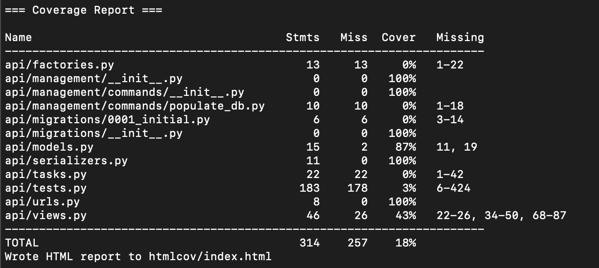

# Leaderboard Application

A Django REST API for a leaderboard application that allows tracking users and their scores.

## Features

- RESTful API for managing users and their scores
- Users start with 0 points
- Leaderboard updates and reorders users based on score
- Add and delete users
- View user details (Name, Age, Points, Address)
- Model factory to fill the database with initial users
- Endpoint that returns users grouped by score with average age
- Scheduled job that identifies the user with the highest points every 5 minutes

## Running with Docker

### Building Locally

```bash
# Build the Docker image
docker build -t leaderboard-app .

# Run the container
docker run -p 8080:8080 leaderboard-app
```

The application will be available at http://localhost:8080

## Local Development Setup

1. Clone the repository:
```bash
git clone https://github.com/Shyam1089/leaderboard_app.git
cd leaderboard_app
```

2. Create a virtual environment and install dependencies:
```bash
python -m venv venv
source venv/bin/activate
pip install -r requirements.txt
```

3. Run migrations:
```bash
python manage.py migrate
```

4. Create initial users:
```bash
python manage.py populate_db --count 10
```

5. Run the development server:
```bash
python manage.py runserver
```


## Project Structure

```
leaderboard_app/
├── api/                  # API app with models, views, and serializers
├── config/               # Django project settings
├── docker/               # Docker configuration files
├── static/               # Static files (CSS, JS)
├── templates/            # HTML templates
├── .github/              # GitHub Actions workflows
├── Dockerfile            # Docker build instructions
├── requirements.txt      # Python dependencies
└── manage.py             # Django management script
```

## API Endpoints

- `GET /api/users/` - List all users
- `POST /api/users/` - Create a new user
- `GET /api/users/{id}/` - Get user details
- `PUT /api/users/{id}/` - Update user
- `DELETE /api/users/{id}/` - Delete user
- `PATCH /api/users/{id}/update_score/` - Update user's score
- `GET /api/users/grouped_by_score/` - Get users grouped by score
- `GET /api/winners/` - List all winners
- `POST /api/update-winners/` - Update winners (called by scheduler/manual button on UI)

## Sample API Calls and Responses

### List All Users

**Request:**
```bash
curl -X GET http://localhost:8000/api/users/
```

**Response:**
```json
{
  "count": 3,
  "next": null,
  "previous": null,
  "results": [
    {
      "id": 1,
      "name": "John Doe",
      "age": 28,
      "address": "123 Main St, Anytown, USA",
      "points": 15
    },
    {
      "id": 2,
      "name": "Jane Smith",
      "age": 32,
      "address": "456 Oak Ave, Somewhere, USA",
      "points": 10
    }
  ]
}
```

### Create a New User

**Request:**
```bash
curl -X POST http://localhost:8000/api/users/ \
  -H "Content-Type: application/json" \
  -d '{
    "name": "Alice Williams",
    "age": 30,
    "address": "101 Maple Dr, Elsewhere, USA",
    "points": 0
  }'
```

**Response:**
```json
{
  "id": 4,
  "name": "Alice Williams",
  "age": 30,
  "address": "101 Maple Dr, Elsewhere, USA",
  "points": 0
}
```

### Get User Details

**Request:**
```bash
curl -X GET http://localhost:8000/api/users/1/
```

**Response:**
```json
{
  "id": 1,
  "name": "John Doe",
  "age": 28,
  "address": "123 Main St, Anytown, USA",
  "points": 15
}
```

### Update User

**Request:**
```bash
curl -X PUT http://localhost:8000/api/users/1/ \
  -H "Content-Type: application/json" \
  -d '{
    "name": "John Doe",
    "age": 29,
    "address": "123 Main St, Anytown, USA",
    "points": 15
  }'
```

**Response:**
```json
{
  "id": 1,
  "name": "John Doe",
  "age": 29,
  "address": "123 Main St, Anytown, USA",
  "points": 15
}
```

### Delete User

**Request:**
```bash
curl -X DELETE http://localhost:8000/api/users/3/
```

**Response:**
```
HTTP/1.1 204 No Content
```

### Update User's Score

**Request:**
```bash
curl -X PATCH http://localhost:8000/api/users/1/update_score/ \
  -H "Content-Type: application/json" \
  -d '{
    "change": 1
  }'
```

**Response:**
```json
{
  "id": 1,
  "name": "John Doe",
  "age": 29,
  "address": "123 Main St, Anytown, USA",
  "points": 20
}
```
NOTE: Only integer values are accepted. Throws a validation error in case invalid integer is posted! 
### Get Users Grouped by Score

**Request:**
```bash
curl -X GET http://localhost:8000/api/users/grouped_by_score/
```

**Response:**
```json
{
  "20": {
    "names": ["John Doe"],
    "average_age": 29
  },
  "10": {
    "names": ["Jane Smith"],
    "average_age": 32
  },
  "0": {
    "names": ["Alice Williams"],
    "average_age": 30
  }
}
```

### List All Winners

**Request:**
```bash
curl -X GET http://localhost:8000/api/winners/
```

**Response:**
```json
{
  "count": 2,
  "next": null,
  "previous": null,
  "results": [
    {
      "id": 2,
      "user": {
        "id": 1,
        "name": "John Doe",
        "age": 29,
        "address": "123 Main St, Anytown, USA",
        "points": 20
      },
      "points_at_win": 20,
      "timestamp": "2023-06-15T14:30:00Z"
    },
    {
      "id": 1,
      "user": {
        "id": 1,
        "name": "John Doe",
        "age": 29,
        "address": "123 Main St, Anytown, USA",
        "points": 15
      },
      "points_at_win": 15,
      "timestamp": "2023-06-15T14:25:00Z"
    }
  ]
}
```

### Update Winners

**Request:**
```bash
curl -X POST http://localhost:8000/api/update-winners/
```

**Response (Success):**
```json
{
  "status": "success",
  "winner": {
    "id": 3,
    "user": {
      "id": 1,
      "name": "John Doe",
      "age": 29,
      "address": "123 Main St, Anytown, USA",
      "points": 20
    },
    "points_at_win": 20,
    "timestamp": "2023-06-15T14:35:00Z"
  }
}
```

**Response (Tie):**
```json
{
  "status": "tie",
  "message": "No winner declared due to a tie"
}
```
**Unit Test Code Coverage Report:**
